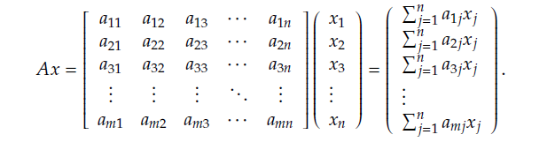
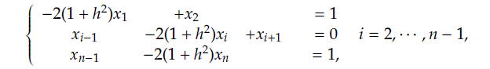

# Prova 1 de Álgebra Linear Computacional

**Questão 1)**

Dados x, y ∊ Rn e a ∊ R, escreva um algoritmo, com complexidade *O(n)*, que aloque em y o vetor ax + y.

~~~c
void alocaY(float * x, float * y, float a, int n){
    for(int i = 0; i < n; i++){
        printf("\n(%.1f * %.1f) + %.1f = ", a, x[i], y[i]);

        y[i] = (a * x[i]) + y[i];

        printf("%.1f", y[i]);
    }
}
~~~

**Questão 2)**

Sejam A ∊ Rm x n e x ∊ Rn. O vetor Ax consiste em

Dados A ∊ Rm x n, x ∊ Rn e y ∊ Rm, escreva um algoritmo, levando em consideração a operação
descrita, que aloque em y o vetor Ax + y. 

~~~c
void alocaY(int m, int n, float ** matriz, float * x, float * y){
    float Ax[m];
    zeraVetor(Ax, m);
    for(int i = 0; i < m; i++){
        for(int j = 0; j < n; j++){
            Ax[i] += (matriz[i][j] * x[j]);
        }
        y[i] = Ax[i] + y[i];
    }
}
~~~

**Questão 3)**

Sejam A ∊ Rm x n e x ∊ Rn. O vetor Ax consiste numa combinação
linear das colunas de A, cujas coordenadas da combinação são as componentes de x, isto é,

Dados A ∊ Rm x n, x ∊ Rn e y ∊ Rm, escreva um algoritmo, levando em consideração a operação
descrita, que aloque em y o vetor Ax + y. 

~~~c
void alocaY(int m, int n, float ** matriz, float * x, float * y){
    float Ax[m];
    zeraVetor(Ax, m);
    int i, j;

    for(i = 0; i < m; i++){
        for(j = 0; j < n; j++){
            Ax[j] += matriz[j][i] * x[i];
        }
    }
    for(int i = 0; i < m; i++) y[i] += Ax[i];
}
~~~

**Questão 4)**

Aplique as implementações dos métodos de *Gauss-Jacobi* e *Gauss-
Seidel* construídas em aula para obter uma aproximação para a solução do sistema linear definido por

com n = 30, h = 0.1 e critério de parada ||x(k+1) - x(k)|| < 10-4. 

*Gauss-Jacobi*
~~~c
void jacobi(float ** A, float * B, float * xK, int m, int n){
    int iteracao = 1;
    float xK1[n];
    float df;
    
    do{
        for(int i = 0; i < m; i++){
            double bi = B[i];
            for(int j = 0; j < n; j++){
                if(j != i){
                    bi -= A[i][j] * xK[j];
                }
            }
            bi /= A[i][i];
            xK1[i] = bi;
        }
        df = normaDif(xK1, xK, n);
        memcpy(xK, xK1, n * sizeof(float));
        iteracao++;
    }while(df > pow(10.0, -4.0));
}
~~~

*Gauss-Seidel*
~~~c
void seidel(float ** A, float * B, float * xK, int m, int n){
    int iteracao = 1;
    float xK1[n];
    float df;
    
    do{
        memcpy(xK1, xK, n * sizeof(float));
        for(int i = 0; i < m; i++){
            double bi = B[i];
            for(int j = 0; j < n; j++){
                if(j != i){
                    bi -= A[i][j] * xK[j];
                }
            }
            bi /= A[i][i];
            xK[i] = bi;
        }
        df = normaDif(xK, xK1, n);
        iteracao++;
    }while(df > pow(10.0, -4.0));
}
~~~